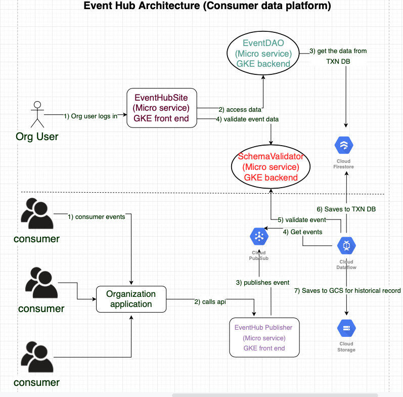

# event-hub-dao
This micro service is responsible in performing CRUD operations needed for Event Hub services. This service is developed using Spring boot & Google firestore client libraries. 

From the following diagram the green highlighted service represents this micro service

## Building docker
mvn compile jib:dockerBuild

## Running docker in local
docker run -p 8080:8080 -v /Users/Raghu/Downloads/:/var/Downloads -e GOOGLE_APPLICATION_CREDENTIALS='/var/Downloads/firestore-svc.json' -e GOOGLE_CLOUD_PROJECT='event-hub-249001' -t gcr.io/event-hub-249001/event-hub-dao:0.0.1-SNAPSHOT

## Pushing to container registry
mvn compile jib:build

## Deploying to GKE
kubectl apply -f deployment.yaml

## Deploying service to GKE
kubectl apply -f service.yaml

## Egress
For letting egress traffic to Firestore please run the following (Needed only if you have istio enabled on GKE namespace)  
kubectl apply -f egress-rule-google-apis.yaml
